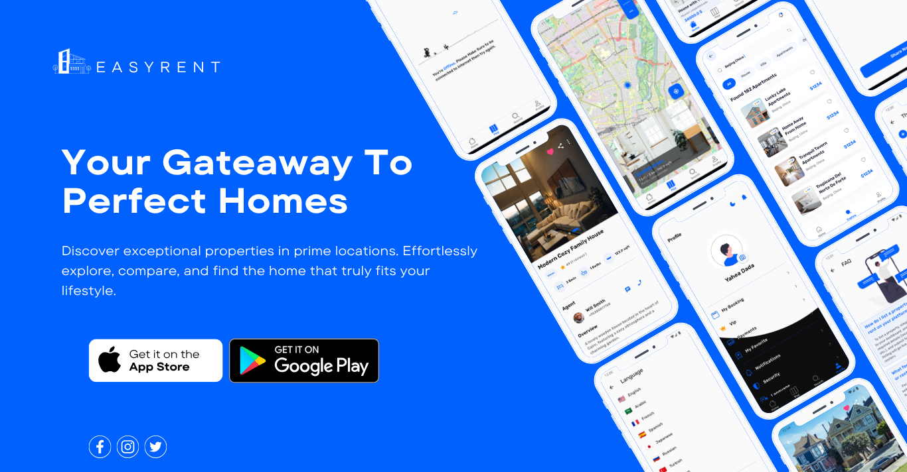

# 🏠 EasyRent – Real Estate Listing & Rental Platform


**Tech Stack**: Flutter, Dart, GetX, Firebase, Stripe API

EasyRent is a cross-platform mobile application designed to simplify the way users explore, list, and rent properties. With modern design principles and advanced features, EasyRent delivers a seamless and engaging user experience for both property seekers and landlords.

---

## 🎥 App Showcase

> _A quick preview of how EasyRent looks and feels in action._


---

## 🚀 Features

### 🌐 Property Discovery
- **Advanced Filtering**: Find properties by location, price, area, room count, and more.
- **Map Integration**: View property locations using interactive maps.
- **360° Panoramic Views**: Virtually tour properties with immersive panoramic images.

### 💳 Payment & Security
- **Stripe Integration**: Secure payment system for subscriptions and premium features.
- **Vault System**: Secure storage for credit card information.

### 🧠 UI/UX & Performance
- **Responsive Design**: Modern interface adaptable to all screen sizes.
- **Shimmer Loading Effects**: Smooth loading experience with shimmer placeholders.
- **Polished Animations**: Clean transitions and user interactions.
- **Optimized Performance**: Lightweight and fast with clean architecture and GetX.

---

## 🛠️ Architecture

The project follows a **clean and scalable architecture**, using a modular service-based structure and separation of concerns across presentation, domain, and data layers.


app achitacture

```
lib
├─ core
│  ├─ app
│  │  ├─ connection
│  │  │  └─ network_status.dart
│  │  ├─ controller
│  │  │  └─ app_controller.dart
│  │  ├─ language
│  │  │  └─ locale.dart
│  │  ├─ middleware
│  │  │  └─ middelware.dart
│  │  ├─ notifications
│  │  │  └─ notificationsApi.dart
│  │  └─ theme
│  │     └─ themes.dart
│  ├─ constants
│  │  ├─ assets.dart
│  │  ├─ colors.dart
│  │  ├─ svgColorReplacer.dart
│  │  └─ utils
│  │     ├─ button.dart
│  │     ├─ divider.dart
│  │     ├─ enums.dart
│  │     ├─ error_loading_mssg.dart
│  │     ├─ offline_page.dart
│  │     ├─ pages
│  │     │  ├─ error_page.dart
│  │     │  ├─ nodata_page.dart
│  │     │  └─ report_page.dart
│  │     ├─ rawSnackBar.dart
│  │     ├─ textFields.dart
│  │     └─ textStyles.dart
│  └─ services
│     └─ api
│        ├─ api_consumer.dart
│        ├─ api_interceptor.dart
│        ├─ dio_consumer.dart
│        ├─ end_points.dart
│        └─ errors
│           ├─ error_model.dart
│           └─ exceptions.dart
├─ data
│  ├─ mockapi.dart
│  ├─ models
│  │  ├─ agent_model.dart
│  │  ├─ favourite_model.dart
│  │  ├─ location_model.dart
│  │  ├─ outer_property_model.dart
│  │  ├─ plan_model.dart
│  │  ├─ propertyModel.dart
│  │  └─ user_model.dart
│  ├─ repos
│  │  ├─ dd.dart
│  │  ├─ properties_repo.dart
│  │  └─ user_repo.dart
│  └─ Session
│     └─ app_session.dart
├─ main.dart
├─ presentation
│  ├─ navigation
│  │  ├─ introduction_screen.dart
│  │  ├─ navigator.dart
│  │  └─ splachScreen.dart
│  └─ views
│     ├─ agent
│     │  ├─ agentcontroller.dart
│     │  └─ agent_page.dart
│     ├─ AgentFeatures
│     │  ├─ singleImage.dart
│     │  └─ uploadProperties_agent.dart
│     ├─ auth
│     │  ├─ bloc
│     │  ├─ views
│     │  │  ├─ forget_password.dart
│     │  │  ├─ login.dart
│     │  │  ├─ signup.dart
│     │  │  └─ verification_code_page.dart
│     │  └─ widgets
│     │     ├─ empty_search_bar.dart
│     │     └─ greeting.dart
│     ├─ map
│     │  └─ map_page.dart
│     ├─ profile
│     │  ├─ cubit
│     │  ├─ view
│     │  │  ├─ profile.dart
│     │  │  └─ profile_pages
│     │  │     ├─ agent-my
│     │  │     │  ├─ myproperties.dart
│     │  │     │  └─ widgets
│     │  │     │     └─ mypropertyCard.dart
│     │  │     ├─ chatbot
│     │  │     │  └─ Ai_chatBot.dart
│     │  │     ├─ Faq
│     │  │     │  ├─ view
│     │  │     │  │  └─ faq.dart
│     │  │     │  └─ widgets
│     │  │     │     └─ faq_item_widget.dart
│     │  │     ├─ favourite
│     │  │     │  ├─ view
│     │  │     │  │  └─ favourite_page.dart
│     │  │     │  └─ widget
│     │  │     │     └─ property_widget_card_favourite.dart
│     │  │     ├─ feedback
│     │  │     │  └─ feedback.dart
│     │  │     ├─ friends
│     │  │     │  └─ invite_friend_page.dart
│     │  │     ├─ language
│     │  │     │  └─ view
│     │  │     │     └─ language.dart
│     │  │     ├─ my_booking
│     │  │     │  ├─ views
│     │  │     │  │  └─ my_booking.dart
│     │  │     │  └─ widget
│     │  │     ├─ notifications
│     │  │     │  ├─ views
│     │  │     │  │  ├─ notifications_drawer.dart
│     │  │     │  │  ├─ notifications_page.dart
│     │  │     │  │  └─ zero_notifications.dart
│     │  │     │  └─ widgets
│     │  │     │     └─ notification_widget.dart
│     │  │     ├─ payment
│     │  │     │  ├─ views
│     │  │     │  │  └─ payment.dart
│     │  │     │  └─ widgets
│     │  │     │     └─ creditCard_widget.dart
│     │  │     ├─ plans
│     │  │     │  └─ plans_page.dart
│     │  │     ├─ security
│     │  │     │  ├─ dialog
│     │  │     │  │  ├─ change_password_dialog.dart
│     │  │     │  │  ├─ delete_account_dialog.dart
│     │  │     │  │  └─ update_userName_dialog.dart
│     │  │     │  └─ view
│     │  │     │     └─ security_page.dart
│     │  │     └─ theme
│     │  │        └─ theme_page.dart
│     │  └─ widgets
│     │     ├─ custome_list_tile.dart
│     │     ├─ dialog
│     │     │  └─ logout_dialog.dart
│     │     ├─ profile_appbar.dart
│     │     └─ theme_language_buttons widget.dart
│     ├─ property_homepage
│     │  ├─ controller
│     │  │  ├─ propertiy_controller.dart
│     │  │  └─ subscription_controller.dart
│     │  ├─ views
│     │  │  ├─ homePage.dart
│     │  │  ├─ property_details_page.dart
│     │  │  └─ seeall.dart
│     │  └─ widgets
│     │     ├─ agent_widget.dart
|     |     |......
│     └─ search
│        ├─ controller
│        │  └─ search_controller.dart
│        ├─ models
│        │  ├─ search_agent_model.dart
│        │  └─ search_property_model.dart
│        ├─ views
│        │  ├─ mockdata.dart
│        │  └─ search_page.dart
│        └─ widgets
│           ├─ agent_feed.dart
│           └─ web_page.dart
|           ......
└─ routes
   ├─ apppages.dart
   └─ routes.dart
```
